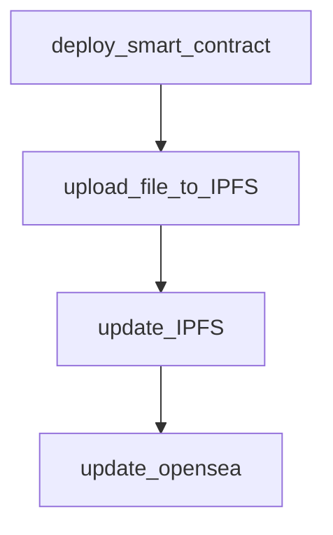

# Smart-Contract-IVG

**This is simple implementation of ERC721 contract which allow u to deploy to Ethereum**

## Token Info
Token name: IVG
Total supply: 1000
Mint price : 0 eth
Max mint per txn: 5
Max token per wallet: 5

## NFT development Progress

